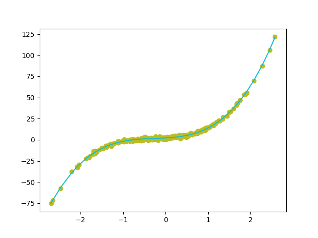
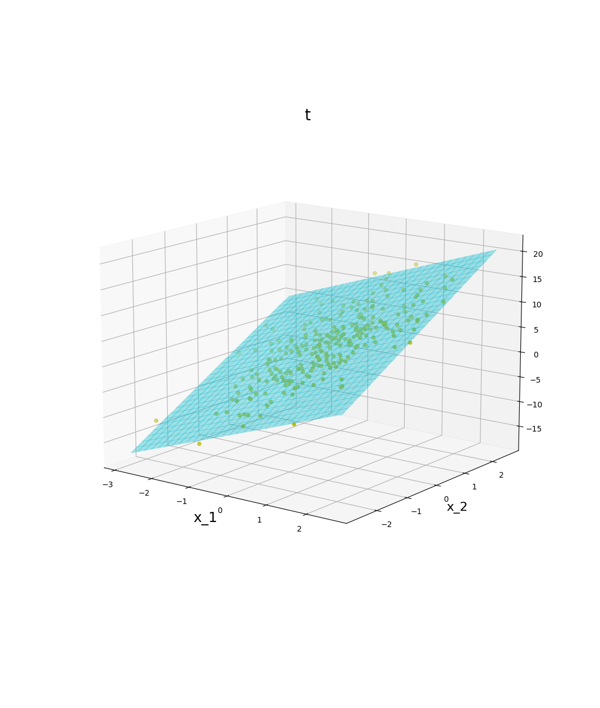
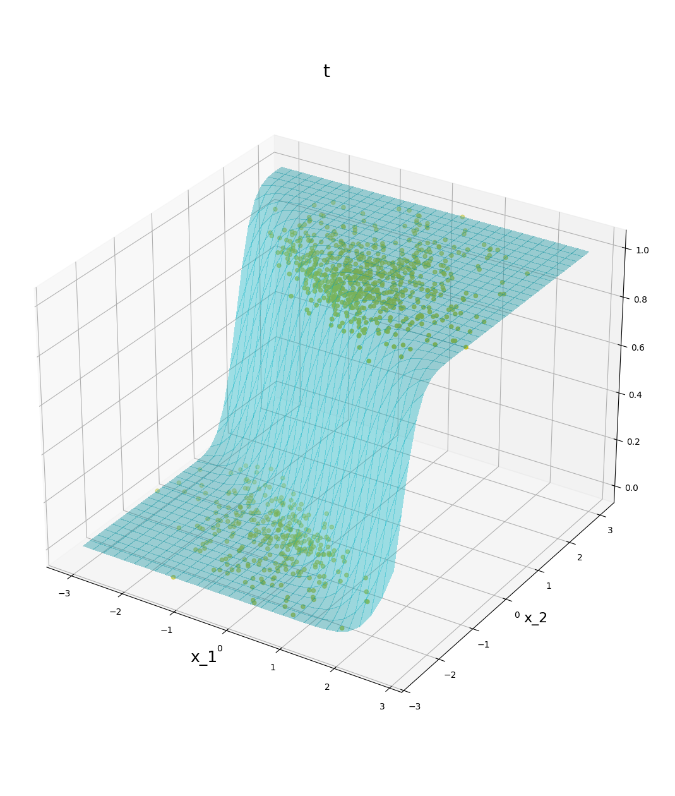

## Regression Models

### Author

Nathan Englehart (adapted from Autumn 2021)

### About

This project is adapted from a project in Stat 339 at Oberlin College. It performs the following tasks:

* Generates data according under the proper assumptions for OLS, probit, and logit regression models
* Leverages OLS, probit, and logit classes written from scratch to model the data 
* Displays graphical output of model predictions

To run this program refer to `run.sh`. 

Two example outputs are listed below. 

1. Let $t = \beta_0 + \beta_1 x_1 + \beta_2 x_1^2 + \beta_3 x_1^3 + \varepsilon$ where $\beta_0 = 2$, $\beta_1 = 3$, $\beta_2 = 4$, $\beta_3 = 5$, and $x_1, \varepsilon \sim \mathcal{N}(0,1)$. Creating a model using the`ols_regression` class in `lib/gd/ols.py` yields the following predictions.

<!---->
 
2. Put $t^{\ast} = \beta_0 + \beta_1 x_1 + \beta_2 x_2 + \varepsilon$ and let $t=1$ when $t^{*} > 0$ and $t=0$ otherwise. Also suppose $\beta_0 = 2$, $\beta_1 = 3$, $\beta_2 = 4$, $x_1, x_2, \varepsilon \sim \mathcal{N}(0,1)$. Creating a model using the `ols_regression` class in `lib/gd/probit` yields the following predictions.

### Notes

This program was written with Python 3.9.19. It leverages several libraries including:

* `numpy`
* `pandas`
* `matplotlib`
* `argparse`
* `itertools`
* `scipy` 

I may add some more regression classes and data generation in the future.

### References

Murphy, Kevin (2012). Machine Learning: A Probabilistic Perspective. MIT Press.

Wooldridge, Jeffrey (2018). Introductory Econometrics (7th ed.). Cengage.
